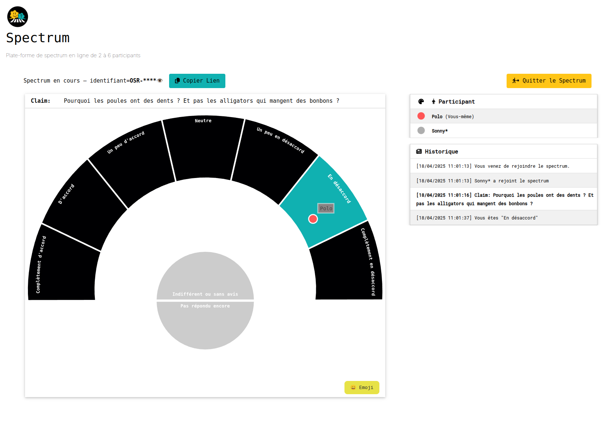

<p align="center">
  
</p>

**OSR Spectrum** is a web application to run Spectrums online with 2 to 6 participants. 

Available here: https://spectrum.utile.space

> OSR stands for "Opinions Sur Rue", a French non-profit organization promoting Street Epistemology, more details on https://www.opinions-sur-rue.fr

---

# 🧠 What Is a Spectrum?
A spectrum is an adaptation of Street Epistemology, a technique rooted in the Socratic method that uses thoughtful questioning to examine the foundations of one's beliefs. In a spectrum, participants physically position themselves along a spectrum line to indicate their level of agreement or disagreement with a given statement. This visual representation facilitates open dialogue and helps individuals understand the diversity of perspectives on complex issues.

## 🎯 Objectives of a Spectrum 

 - Encourage critical thinking and self-reflection on personal belief.
 - Foster respectful and meaningful conversations among individuals with differing viewpoint.
 - Develop skills in active listening and constructive dialogu.
 - Promote understanding and empathy through shared exploration of idea.

## 🛠️ How It Works

1. **Statement Presentation**: A facilitator introduces a thought-provoking statement for discussion.
2. **Physical Positioning**: Participants stand along a spectrum line that represents a range of agreement or disagreement with the statement.
3. **Dialogue and Exploration**: Through guided questions and discussions, participants share their reasoning, challenge assumptions, and consider alternative viewpoints.
4. **Reflection and Adjustment**: As the conversation progresses, individuals may choose to adjust their position on the spectrum, reflecting a shift in their perspective based on the dialogue.

## ⚠️ Consideration

Engaging in a Spectrum requires a willingness to openly express one's beliefs and to respectfully consider differing opinions. Participants should be prepared for the possibility of standing alone in their viewpoint and should feel comfortable with public discourse.

For a practical demonstration of a Spectrum, you can watch the following video:

[](https://www.youtube.com/watch?v=TjWYUv3QqZo)


--- 


# ⭐ How to use OSR Spectrum?

The easiest to run an online spectrum is to use: 

- The official instance (but in French only) from the non-profit organization "Opinions Sur Rue": https://spectrum.opinions-sur-rue.fr


- or the experimental instance maybe less stable but with all experimental features: https://spectrum.utile.space

- the third option is you to run the software from that repository.

## 🚀 Deploying your own instance

As you can see the application in split in two parts: 
- a frontend made with Svelte,
- and a backend written in Golang. 

To run the application we recommend you to use the docker-compose.yml provided in that repo. 

Configure the [`.env`](.env) first with your desired logo, name, and domain names. 

Then clone the project on your host running Docker and run:
``` 
docker-compose up -d
```

We recommend using Traefik as a web server/reverse proxy as it is pretty straightforward to setup as you can see in our `docker-compose.yml`.


---


# ✍️ How to contribute?

Thank you for considering contributing to OSR Spectrum! We welcome contributions from everyone.

## 🪲 Reporting Bugs

If you find a bug, please [open an issue](https://github.com/Opinions-sur-Rue/spectrum/issues) and include:

- A clear and descriptive title.
- Steps to reproduce the issue.
- Expected and actual behavior.
- Screenshots or logs, if applicable.

## 🪄 Suggesting Enhancements

We appreciate suggestions for new features or improvements. Please [open an issue](https://github.com/Opinions-sur-Rue/spectrum/issues) and provide:

- A clear and descriptive title.
- A detailed description of the enhancement.
- Any relevant examples or use cases.

## 📂 Submitting Pull Requests

To contribute code:

1. Fork the repository.
2. Create a new branch (`git checkout -b feature/your-feature-name`).
3. Make your changes.
4. Ensure your code follows the project's coding standards.
5. Write or update tests as needed.
6. Commit your changes (`git commit -m 'Add your message here'`).
7. Push to your fork (`git push origin feature/your-feature-name`).
8. Open a pull request.

Please ensure your pull request includes:

- A clear description of the changes.
- Reference to any related issues.
- Relevant tests and documentation updates.

## 💪 Code of Conduct

This project adheres to a [Code of Conduct](CODE_OF_CONDUCT.md). By participating, you are expected to uphold this code.

## 🤔 Questions?

If you have questions or need assistance, feel free to [open an issue](https://github.com/yourusername/yourproject/issues) or reach out to the maintainers.